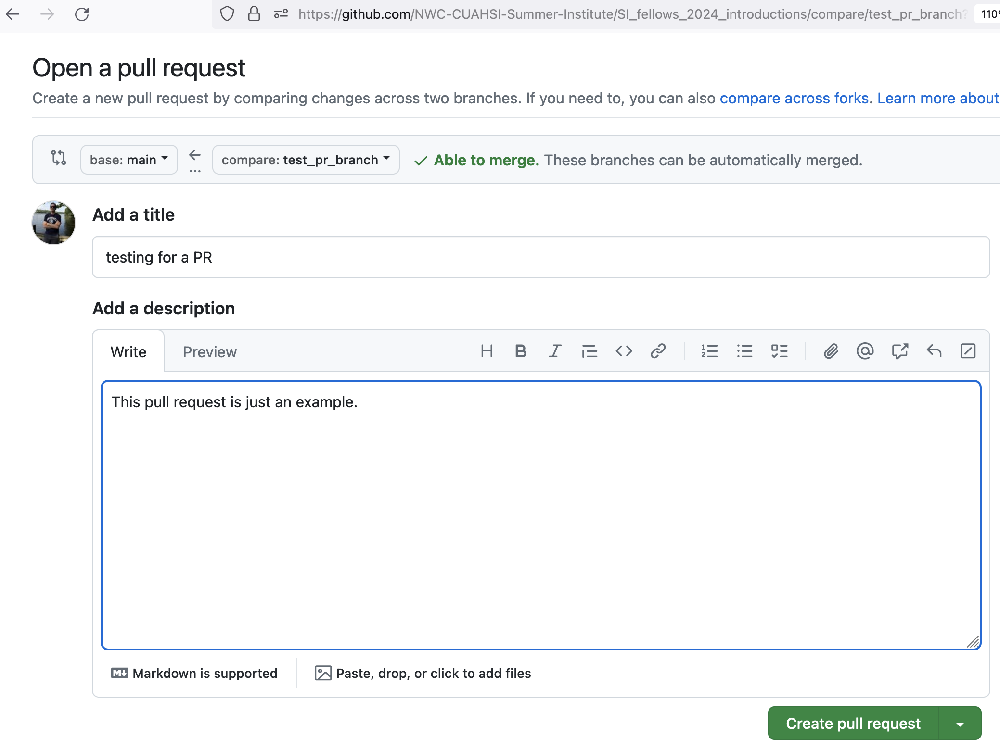

# Summer Institute 2024 - GitHub Training

Welcome to the National Water Center Innovators Program Summer Institute GitHub training repository! This repository is designed to help participants of the Summer Institute get comfortable with using GitHub, a tool for collaborative software development and data science.

#### Training Objective

The goal of this training is to familiarize you with the basics of GitHub. You will learn how to clone a repository, make edits, and commit changes. This exercise is intended to prepare you for contributing to collaborative projects during the Summer Institute, ensuring that all code and findings are public and reproducible.
Getting Started

## 0. Prerequisites
We will be using the CIROH 2i2c cloud compute platform during the Summer Institute bootcamp. You can access that platform here: https://ciroh.awi.2i2c.cloud/. Please start up a "small" compute instance. It might take a minute or two to start up. When it starts, it will open up a bash terminal on the right, and a file explorer on the left.

## 1. Sign up for GitHub
You probably already have a GitHub account, but just in case you don’t, you can sign up [here](https://github.com).

#### Generating a Personal Access Token on GitHub:

1. **Log in to GitHub**:
   - Go to GitHub and log in.

2. **Open Settings**:
   - Click your profile picture > Settings.

3. **Access Developer Settings**:
   - In the left sidebar, click Developer settings.

4. **Create a New Token**:
   - Click Personal access tokens > Tokens (classic) > Generate new token.

5. **Set Token Details**:
   - Give your token a descriptive name.
   - Select the scopes (permissions): `repo` (Full control of private repositories).

6. **Generate Token**:
   - Click Generate token.

7. **Save the Token**:
   - Copy the generated token and save it securely. You won’t be able to see it again.
   - Use this token as the password when you push your modifications.

## 2. Request Access to AWI 2i2c
For the Summer Institute bootcamp, we’ll use a cloud computing platform hosted by The Alabama Water Institute.

1. Visit [this website](https://docs.ciroh.org/docs/services/access/).
2. Click on “Public Infrastructure Request Form” under “Public Cloud”.

Fill out the form with the following information:

**1.    Requester Information:**
Requester Name: [your name here]  
Requester Institution: [your university here]  
Requester email address: [your email address]  
PI's Full Name: Jonathan Frame  
PI's Affiliated Institute: Lynker  
PI's Affiliated Email Address: jonathan's email  

**2.    Project Information:**
Summer Institute Bootcamp, 2024. The bootcamp will include training on basic computational skills, and this will be done on the AWI 2i2c resource. All bootcamp participants will need access to this cloud compute platform.

**3.  Project Description:**
We will use many different software types, depending on the specific training workshop. This will include GitHub, Python, and more.

**4.    Resource Requirements:**
We can use mostly the same 2i2c compute environments that were set up for the CIROH DevCon.

**5.    Timeline:**
June 10th - July 25th
 
**6.    Security and Compliance Requirements:**
N/A
 
**7.    Estimation:**
Unknown
  
**8.    Approval:**
Unknown


## 3. Log into AWI 2i2c
1. Go to ciroh.awi.2i2c.cloud.
2. Choose Server Option – Small machine with image: “New Pangeo Notebook base image 2024.04.08”.


## 4. Clone the Repository
1. Go to the GitHub site for our repository: NWC-CUAHSI-Summer-Institute/SI_fellows_2024_introductions, and click on the green button to copy the HTTPS address.

3. In Jupyter environment, type:
```
git clone https://github.com/NWC-CUAHSI-Summer-Institute/SI_fellows_2024_introductions.git
```


## 5. Set Up Your Git Information on the Jupyter Platform
1. Click on "View" and toggle on "Show hidden files".

3. Edit the `.git/config` file with:
```
[user]
    email = youremailassociatedwithgithub@university.edu
    name = yourgithubusername
```


## 6. Make a New Branch

1. Understand the difference between forks and branches: [Fork vs Branch](https://www.ssw.com.au/rules/fork-vs-branch/).
2. Create a new branch:
```
git checkout -b [your_branch_name]
```


## 7. Add Your Information to the text document

1. Open the `introductions.txt` file in Jupyter Lab.
2. Add a few notes about yourself.

## 8. Commit Your Changes

1. Stage and commit your changes:

```
git add introductions.txt
git commit -m "Added my name and interests"
```


## 9. Push Your Changes

1. Push your branch to the remote repository:

```
git push --set-upstream origin [your_branch_name]
```


## 10. Create a Pull Request

1. Go to the GitHub repository website.
2. Click the “Compare & pull request” button.

4. Fill in the pull request details and submit.


By following these steps, you’ll contribute your changes to the repository and learn the basics of GitHub workflows.


